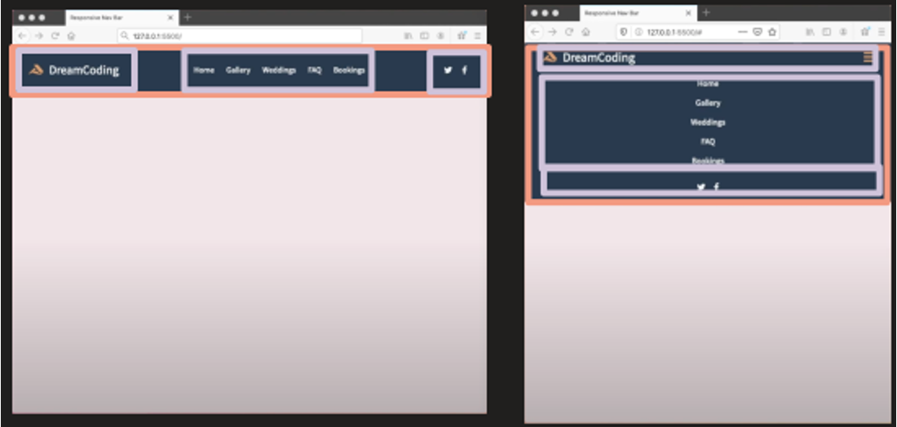

## 반은형 네비게이션 Clone Coding

**[YouTube Dream Coding](https://www.youtube.com/watch?v=X91jsJyZofw&list=PLv2d7VI9OotQ1F92Jp9Ce7ovHEsuRQB3Y&index=14) 참조**

웹 사이트 블록 모델 분석

Clone Coding 결과물 [확인하기](./index.html)

### 주요 아이디어
- flexbox의 자유로운 사용
- width: 100%를 활용한 정렬
- JS를 활용한 이벤트 처리