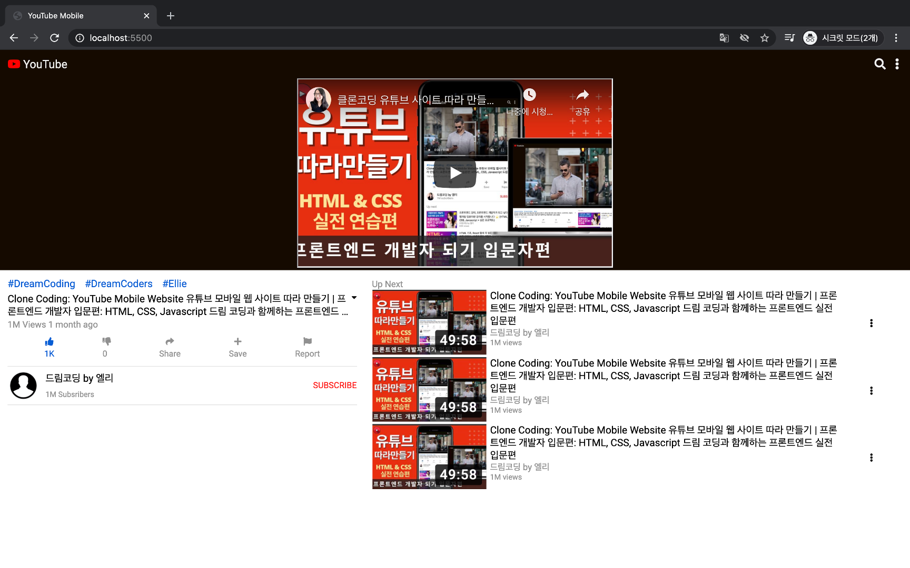
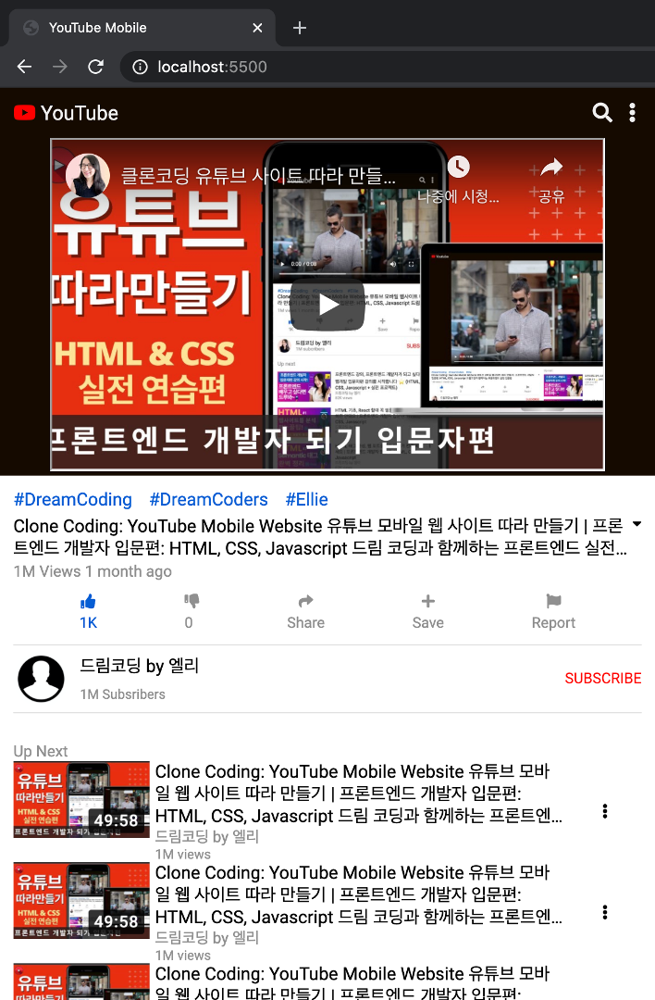

## YouTube Mobile 화면 클론 코딩

[유튜브 강의](https://www.youtube.com/watch?v=67stn7Pu7s4)를 기반으로 클론 코딩한 결과입니다.

**전체 화면**

**모바일 화면**

### 클론 코딩 주요 사항
- media query를 기반으로 크기에 따를 페이지 처리
- Flex Box의 적절한 활용
- class 이름 짓는 것이 상당히 어려움